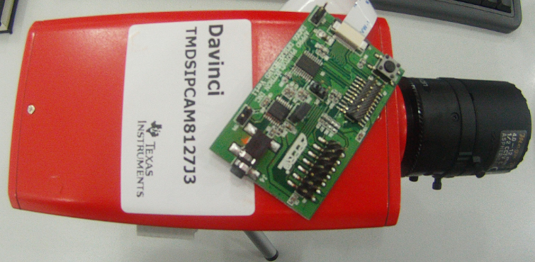
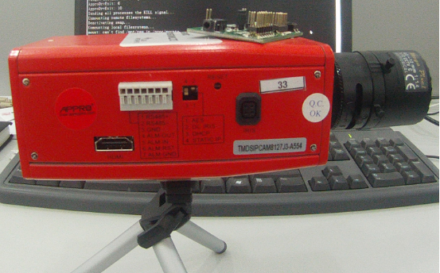

## dm81xx rdk ##

[返回](/dm81xx/)

1.	下载地址

	*	无下载地址，由第三方提供，版本3.5
	*	硬件介绍 - [appropho](http://www.appropho.com/NewWeb/Product_DM8127J3.php)

2.	重点说明

	*	有hdvpss源码，使用复杂
	*	无TVP5147驱动
	*	应用框架复杂，要裁剪
	*	需安装软件： sudo apt-get install bison flex mtd-utils

3. 文档内容介绍

	*	[数据手册 - SPRS712_DM8127_DataManual_06_26_12.pdf](http://192.168.0.239/gitweb/?p=repositories/dm814x/dm814x-dev.git;a=blob;f=doc/dm8127/datasheet/SPRS712_DM8127_DataManual_06_26_12.pdf;h=40d5f08f6b452dab48a062ade28949cf8a61a7c8;hb=2f5e8c813b5c0961025f4db5faaaa39f816d3f48)

	*	[IPNC_RDK_InstallGuide.pdf](http://192.168.0.239/gitweb/?p=repositories/dm814x/dm814x-dev.git;a=blob_plain;f=doc/dm8127/rdk3.5/IPNC_RDK_InstallGuide.pdf;hb=HEAD)

		1.	安装介绍
		2.	编译介绍
		3.	内容组织
		4.	uboot烧写、参数

	*	[IPNC_RDK_McFW_UserGuide.pdf](http://192.168.0.239/gitweb/?p=repositories/dm814x/dm814x-dev.git;a=blob_plain;f=doc/dm8127/rdk3.5/Collaterals/IPNC_RDK_McFW_UserGuide.pdf;hb=HEAD)

		1.	McFW 软件层次
		2.	Link、Chain 概念， API
		3.	Frame 结构
		4.	应用示例介绍

4.	RDK软件包基本组织

	*	ipnc_rdk_ga_release3.5.0/rdk.git
<pre><code>
meegoo@mg:rdk.git$ pwd
/home/meegoo/workspace/dm814x/ipnc_rdk_ga_release3.5.0/rdk.git
meegoo@mg:rdk.git$ tree -L 1
.
├── Binaries    Pre Built Binaries for executing IPNC RDK application
├── Collaterals Documents on various app note, user guides, integration guide, datasheet and training on McFW.
├── Hardware    Contains gerber, schematics and HW docs
├── Source      IPNC RDK source code resides here
└── Utils       Contains NAND flash utilities like NAND flash writer and Gel files. It also contains filesystem
</code></pre>

	*	ipnc_rdk_ga_release3.5.0/rdk.git/Source/ipnc_rdk
<pre><code>
meegoo@mg:ipnc_rdk$ pwd
/home/meegoo/workspace/dm814x/ipnc_rdk_ga_release3.5.0/rdk.git/Source/ipnc_rdk
meegoo@mg:ipnc_rdk$ tree -L 1
.
├── ipnc_app   Core IPNC application code
├── ipnc_mcfw  Source code for Multi Channel Framework
├── target     Target File System. This can be exported from NFS server
├── tftp       Stores uImage, uBoot and filesys that can be exported from TFTP server
</code></pre>

5. 初始Uboot启动参数
	
	*	出厂uboot参数 - nand 启动方式
<pre><code>
TI8148_IPNC#printenv
bootdelay=2
baudrate=115200
autoload=yes
verify=yes
bootfile=uImage
ramdisk_file=ramdisk.gz
loadaddr=0x81000000
script_addr=0x80900000
loadbootscript=fatload mmc 0 ${script_addr} boot.scr
bootscript= echo Running bootscript from MMC/SD to set the ENV...; source ${script_addr}
ethaddr=84:7e:40:6f:91:6a
ethact=cpsw
filesize=2680000
bootcmd=ipnc_ff_init 0;nboot 0x81000000 0 0x280000; bootm
bootargs=console=ttyO0,115200n8 rootwait=1 rw ubi.mtd=4,2048 rootfstype=ubifs root=ubi0:rootfs init=/init mem=80M vram=4M notifyk.vpssm3_sva=0xBFD00000 ip=dhcp eth=00.0C.0C.02.39.80 cmemk.phys_start=0x85000000 cmemk.phys_end=0x89000000 cmemk.allowOverlap=1 earlyprintk
stdin=serial
stdout=serial
stderr=serial
ver=U-Boot 2010.06-00023-g6d4b40c (Dec 21 2012 - 20:03:36) DM8127_IPNC_3.50.00
Environment size: 779/8188 bytes
</code></pre>

6. 实际应用问题

	*	[issue - TimeOut occure in boot_proc](http://e2e.ti.com/support/dsp/davinci_digital_media_processors/f/716/p/245286/860328.aspx)
		*	You can change STREAMTYPE_DEFAULT to 0 (single stream) in ../ipnc_rdk/ipnc_app/interface/inc/system_default.h file and build the code.Also you need to delete sysenv.cfg file present in /mnt/nand on IPNC so that your new default value is saved in nand.
		*	From web GUI change to single stream.

7. 硬件

	

	

8. 流媒体
	
	*	VLC播放
<pre><code>
Play this stream using the URL:
        rtsp://192.168.55.100:8557/PSIA/Streaming/channels/2?videoCodecType=H.264
(We use port 8304 for optional RTSP-over-HTTP tunneling.)
...done initializing
Play this stream using the URL:
        rtsp://192.168.55.100:8554/PSIA/Streaming/channels/1?videoCodecType=MPEG4
(We use port 8301 for optional RTSP-over-HTTP tunneling.)
Play this stream using the URL:
        rtsp://192.168.55.100:8553/PSIA/Streaming/channels/1?videoCodecType=MPEG4
(We use port 8300 for optional RTSP-over-HTTP tunneling.)
Play this stream using the URL:
        rtsp://192.168.55.100:8555/PSIA/Streaming/channels/0?videoCodecType=MJPEG
</code></pre>

9. 运行重编译软件包

	1.	执行 sdk-dm814x.sh 切换 DM814X_SDK=ipnc_rdk_ga_release3.5.0， 重启终端

	2.	执行 build.py , 路径：dm814x-dev.git/project/base
	
	3.	主机配置好 tftp、nfs 服务器
	
	4.	连接设备， 在 minicom 运行脚本 tftp_nfs.minicom
	
	5.	重启设备， 运行

[返回](/dm81xx/)

