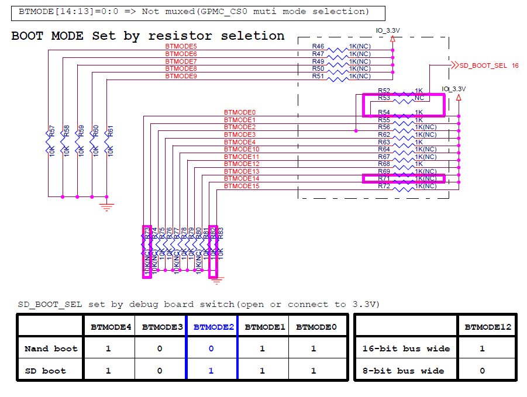

## TI DM81xx boot ##

[返回](/dm81xx/issue)

*	DM8148 boot

	

	

	[TMS320DM8148x DaVinci Digital Video Processors.pdf - page.152](http://192.168.0.239/gitweb/?p=repositories/dm814x/dm814x-dev.git;a=blob_plain;f=doc/dm8148/Datasheet/TMS320DM8148x+DaVinci+Digital+Video+Processors.pdf;hb=47291e764ffac9882ab28d0802fe2f58ed4d51eb)

	

	[MS_TI_DM814x_BB_REVD_SCH.pdf - page.13](http://192.168.0.239/gitweb/?p=repositories/dm814x/dm814x-dev.git;a=blob;f=doc/dm8148/Mistralsolutions+Rev+D/MS_TI_DM814x_BB_REVD_SCH.pdf;h=dc560daddaf22ee1413ce511d517d1eb33f9b2a9;hb=47291e764ffac9882ab28d0802fe2f58ed4d51eb)

	*	8bit nand flash模式

		*	SW1.5~SW1.1 = 10010
		*	SW1.8 = 0 [8bit]
		*	SW2.1 = 1 [nand interface]
		*	SW11.3 = 0 [Writeable]

	*	16bit nand flash模式

		*	SW1.5~SW1.1 = 10010
		*	SW1.8 = 1 [16bit]
		*	SW2.1 = 1 [nand interface]
		*	SW11.3 = 0 [Writeable]
	
	*	SD 模式

		*	SW1.5~SW1.1 = 10111

*	DM8127 boot

	

	[ 514642b_camera_card_sep22_2011b.pdf - page.3](http://192.168.0.239/gitweb/?p=repositories/dm814x/dm814x-dev.git;a=blob_plain;f=doc/dm8127/rdk3.5/Hardware/DM8127/Schematic/514642b_camera_card_sep22_2011b.pdf;hb=2279b0d9a983303c3e67a09497e9841c1d7d67f0)

*	[RDK8127 SD boot - IPNC_RDK_InstallGuide.pdf](http://192.168.0.239/gitweb/?p=repositories/dm814x/dm814x-dev.git;a=blob_plain;f=doc/dm8127/rdk3.5/IPNC_RDK_InstallGuide.pdf;hb=2279b0d9a983303c3e67a09497e9841c1d7d67f0)
	
	1.	Change the BINARY_MODE to ‘sd’ mode in Rules.Make
	
	2.	make uboot.min and uboot.bin for SD card. Uboot.min for SD card is named as MLO.
		
		$ cd <IPNC_RDK_BASE>/ipnc_rdk    
		$ make –s ubootmin    
		$ make –s ubootbin    
		This will make the MLO and uboot.bin in $TFTP_HOME set in Rules.make    

	3.	Create NFS tar ball. NFS tar ball. Creation should be layer below filesys. Ex-

		$ cd <IPNC_INSTALL_DIR>/target/filesys   
		$ sudo tar cvfz nfs.tar.gz ./*   

	4.	Format SD card

		Copy images MLO, u-boot.bin, uImage and mksd-ti81xx.sh from TFTP_HOME and nfs.tar.gz created in above steps to a directory on this Linux machine. For subsequent description, we will assume these files exists in TFTP_HOME.
		mksd-ti81xx.sh is located at <install dir>/Utils/sd-script

*	使用已编译的镜像，制作引导SD卡 - dm814x-dev.git/demo/boot/rdk

	1.	使用工具 mk_sd_low_power.sh 制作SD卡
	
	2.	sd.minicom 设置 uboot 参数

	3.	启动后，删除/mnt/nand下的所有文件，然后重启目标板

*	使用已编译的镜像，烧写nand - dm814x-dev.git/demo/boot/rdk

	1.	使用工具 mk_nand_low_power.sh 复制镜像到 tftpboot
	
	2.	nand.minicom 设置 uboot 参数

	3.	uboot 提示符下：	run uboot_renew 更新 uboot

	4.	uboot 提示符下：	run uimage_renew 更新 uimage

	5.	uboot 提示符下：	run ubifs_renew 更新 ubifs

*	UART 模式启动引导程序

	1.	安装\\\\192.168.0.239\\飞行项目组资料共享\\开发类资料\\dm81xx\\tools\\SecureCRT7.0.rar
	
	2.	复制预编译二进制文件：\\\\192.168.0.239\\飞行项目组资料共享\\开发类资料\\dm81xx\\binary\\ti814x-uboot-uart

	3.	启动SecureCRT7.0,配置dm8127为nand启动，nand无引导程序，打印“CCCCCCCC”，提示UART启动, XMODEM 发送文件

		

	4.	完成后得到提示符“TI-MIN#”，输入“loady 0x81000000”
	
	5.	YMODEM 发送文件u-boot.bin.nand-ti814x-evm

		

	6.	完成后运行“go 0x81000000”，2nd boot运行，设置uboot参数，再通过uboot烧写程序

[返回](/dm81xx/issue)

