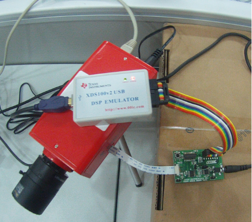
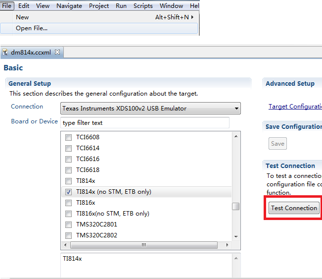
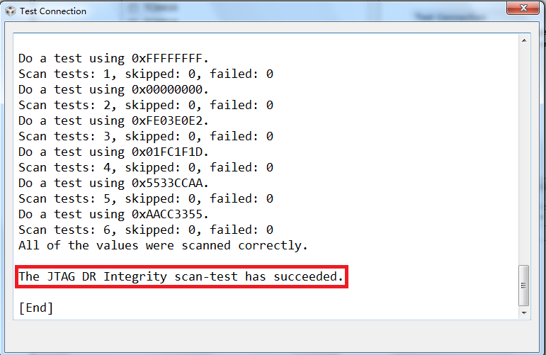
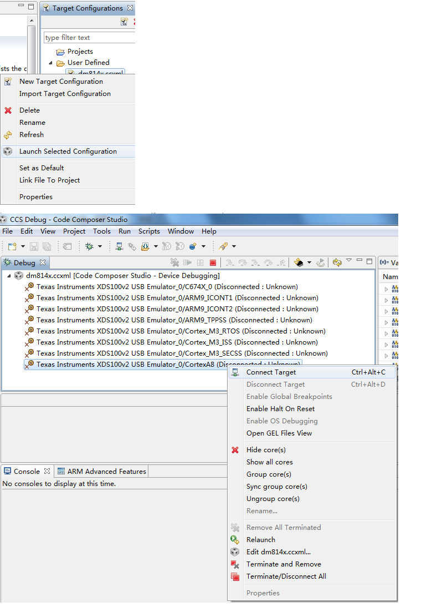
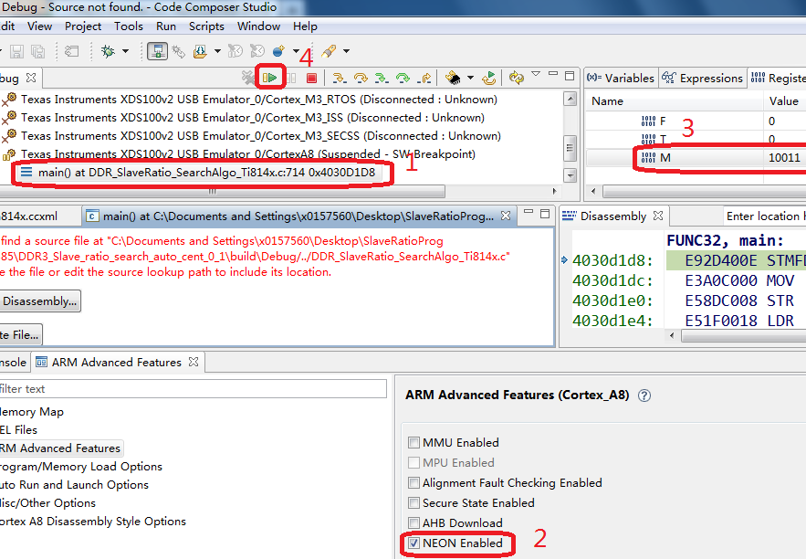

## TI DM81xx 使用ccs得到ddr3相关参数 ##

[返回](/dm81xx/issue/ddr3)

1.	ccs5.3软件安装

	*	解压工具： \\\\192.168.0.239\\飞行项目组资料共享\\开发类资料\\dm81xx\\tools\\7z922.exe
	
	*	软件位置： \\\\192.168.0.239\\飞行项目组资料共享\\开发类资料\\dm81xx\\tools\\ccs5.3，安装linux或windows版本软件；
	
	*	license： \\\\192.168.0.239\\飞行项目组资料共享\\开发类资料\\dm81xx\\tools\\ccs5.3\\license，按说明破解；
	
	*	[project](http://192.168.0.239/gitweb/?p=repositories/dm814x/dm814x-dev.git;a=tree;f=project/ddr3_config;h=13da201dd5ea21f0cfd5195e52c1041a6274f1b0;hb=a35ad9bbc06cd5d4488ba101b74b94defe02b20e)，拷贝此文件夹到本地；

2.	连接硬件，完成后上电

	

3.	使用ccs打开ccs_ddr3中的设备配置文件dm814x.ccxml，测试设备连接

	

	点击“Test Connection”进行测试，成功后的显示内容如下：

	

	到此，完成硬件连接的测试。

4.	使用设备文件连接

	*	Select View -> Target Configurations. Look for the target configuration dm814x.ccxml
	
	*	Right click and click "Launch Selected Configuration" this should launch debug session
	
	*	Right click on the Cortex A8 core listed and click on "Connect Target"

	

5.	装载GEL文件

	*	Select Tools -> GEL Files in CCS
	
	*	This opens a new tab in the Debug view. On right hand side empty area in this window, right click and use "Load GEL"
	
	*	Navigate to the directory containing gel file and select TI814x_ddr3.gel
	
	*	A "Scripts" menu item (on top) should now be available
	
	*	Select Script -> TI814x DDR Configuration -> DDR3_EMIF0_EMIF1_400MHz_Config
	
	*	This will perform DDR3 initialization.
	
	*	On success, you should see following at the CCS console:
	
<pre><code>
CortexA8: GEL Output: 	 ****  Configuring DDR PLL to 400 MHz......... 
CortexA8: GEL Output: 	DM814x DDR DPLL CLKOUT  value is  = 400 
CortexA8: GEL Output: 	DM814x DDR3 EVM EMIF0 and EMIF1 configuration in progress......... 
CortexA8: GEL Output: 	DM814x DDR,DMM PRCM configuration is Done 
CortexA8: GEL Output: 	DM814x DDR PHY Configuration is Done 
CortexA8: GEL Output: 	DM814x DDR IO Control Configuration is Done 
CortexA8: GEL Output: 	DM814x VTP Configuration is Done 
CortexA8: GEL Output: 	DM814x DMM LISA register Configuration is Done
CortexA8: GEL Output: 	DM814x DDR3 EVM EMIF0 and EMIF1 configuration is DONE. 
</code></pre>

6.	运行程序

	

	1.	Goto menu View -> Registers
	
	2.	Expand CPSR
	
	3.	Select “M” and set it to 0x13
	
	4.	These steps set the CPSR.M to 0x13 (SPV mode).
	
	5.	Goto Tools -> ARM Advanced Features select NEON Enabled
	
	6.	Select Run -> Load -> Load Program. Select the CCS program DDR3_SlaveRatio_ByteWiseSearch_TI814x.out for loading.

<pre><code>
[CortexA8] Enter 0 for DDR Controller 0 & 1 for DDR Controller 1 
0
DDR START ADDR=0x80000000
Enter the Seed Read DQS Gate Ratio Value in Hex to search the RD DQS Gate Window
0xa5
Enter the Seed Read DQS Ratio Value in Hex to search the RD DQS Ratio Window
0x34
Enter the Seed Write DQS Ratio Value in Hex to search the Write DQS Ratio Window
0x13
Enter the input file Name 
Ti814x_Ratio_values_0
*********************************************************
	Byte level Slave Ratio Search Program Values  
*********************************************************
			BYTE3	BYTE2	BYTE1	BYTE0
*********************************************************
Read DQS MAX		6f 	6f 	6f 	74
Read DQS MIN		9 	9 	9 	6
Read DQS OPT		3c 	3c 	3c 	3d
*********************************************************
Read DQS GATE MAX	14a	14d 	13a 	133
Read DQS GATE MIN	0	0 	0 	0
Read DQS GATE OPT	a5	a6 	9d 	99
*********************************************************
Write DQS MAX		81 	82 	7f 	80
Write DQS MIN   	0 	0 	0 	0
Write DQS OPT		40 	41 	3f 	40
*********************************************************
Write DATA MAX		b3 	af 	af 	ae
Write DATA MIN		44 	46 	46 	46
Write DATA OPT		7b 	7a 	7a 	7a
*********************************************************
</code></pre>

7.	修改uboot

	*	Open the file arch/arm/include/asm/arch-ti81xx/ddr_defs_ti814x.h

<pre><code>
/* TI814X DDR3 PHY CFG parameters <emif0 : emif 1> */
#define DDR3_PHY_RD_DQS_CS0_BYTE0 ((emif == 0) ? 0x38 : 0x3A)
#define DDR3_PHY_RD_DQS_CS0_BYTE1 ((emif == 0) ? 0x37 : 0x36)
#define DDR3_PHY_RD_DQS_CS0_BYTE2 ((emif == 0) ? 0x32 : 0x37)
#define DDR3_PHY_RD_DQS_CS0_BYTE3 ((emif == 0) ? 0x31 : 0x33)
#define DDR3_PHY_WR_DQS_CS0_BYTE0 ((emif == 0) ? 0x43 : 0x49)
#define DDR3_PHY_WR_DQS_CS0_BYTE1 ((emif == 0) ? 0x44 : 0x4E)
#define DDR3_PHY_WR_DQS_CS0_BYTE2 ((emif == 0) ? 0x53 : 0x54)
#define DDR3_PHY_WR_DQS_CS0_BYTE3 ((emif == 0) ? 0x50 : 0x50)
#define DDR3_PHY_RD_DQS_GATE_CS0_BYTE0 ((emif == 0) ? 0xE4 : 0xD3)
#define DDR3_PHY_RD_DQS_GATE_CS0_BYTE1 ((emif == 0) ? 0x111 : 0xF7)
#define DDR3_PHY_RD_DQS_GATE_CS0_BYTE2 ((emif == 0) ? 0x112 : 0x109)
#define DDR3_PHY_RD_DQS_GATE_CS0_BYTE3 ((emif == 0) ? 0x13D : 0x135)
#define DDR3_PHY_WR_DATA_CS0_BYTE0 ((emif == 0) ? 0x85 : 0x8A)
#define DDR3_PHY_WR_DATA_CS0_BYTE1 ((emif == 0) ? 0x83 : 0x80)
#define DDR3_PHY_WR_DATA_CS0_BYTE2 ((emif == 0) ? 0x85 : 0x7F)
#define DDR3_PHY_WR_DATA_CS0_BYTE3 ((emif == 0) ? 0x7F : 0x85)
</code></pre>

[返回](/dm81xx/issue/ddr3)

